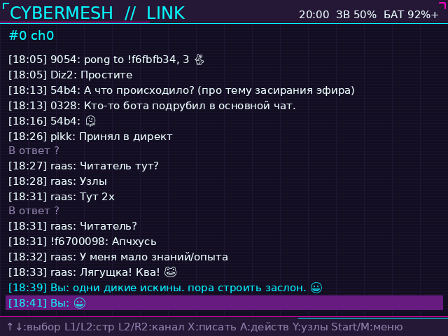
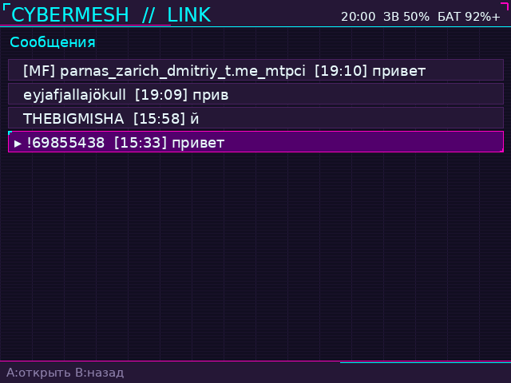
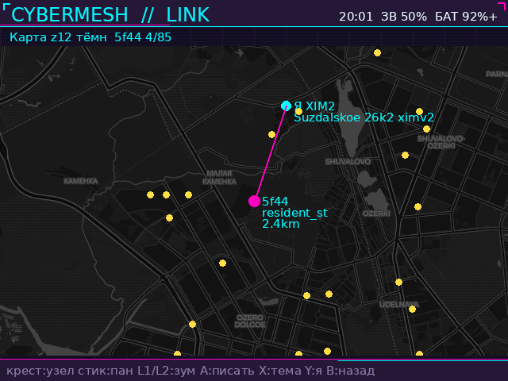
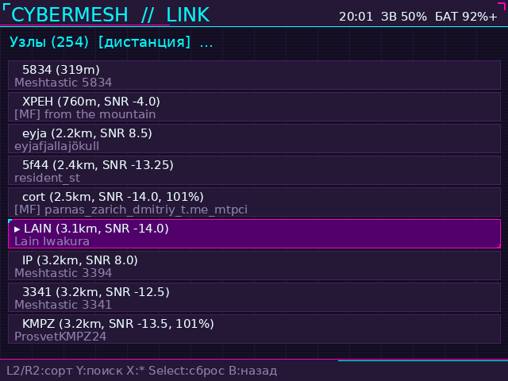
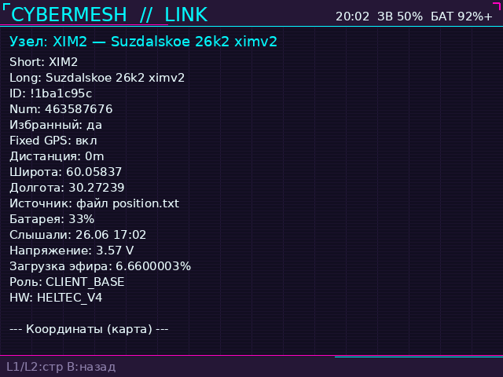
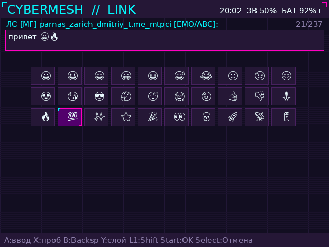
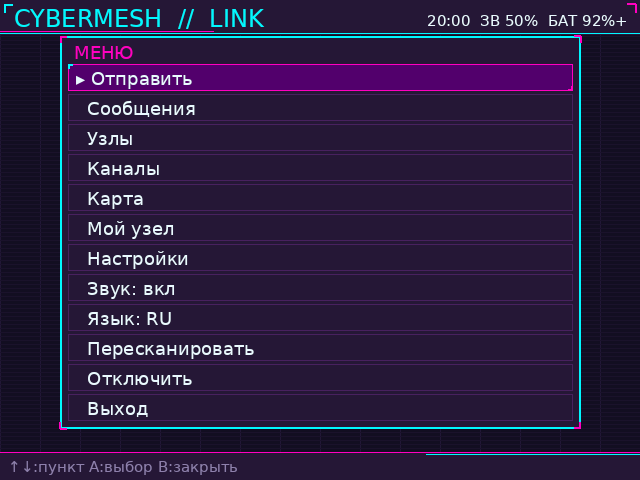
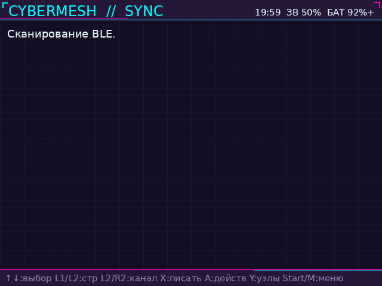

# Cybermesh

BLE-клиент для Anbernic RG35xx (640×480, SDL mali).

Репозиторий: [github.com/maximv/cybermesh-rg35xx](https://github.com/maximv/cybermesh-rg35xx)

## Скриншоты

<table>
  <tr>
    <td align="center"><br>Чат основного канала</td>
    <td align="center"><br>Список переписок</td>
  </tr>
  <tr>
    <td align="center"><br>Карта узлов</td>
    <td align="center"><br>Список узлов</td>
  </tr>
  <tr>
    <td align="center"><br>Информация об узле</td>
    <td align="center"><br>Клавиатура с эмодзи и счётчиком</td>
  </tr>
  <tr>
    <td align="center"><br>Меню</td>
    <td align="center"><br>Поиск BLE</td>
  </tr>
</table>

Скриншоты снимаются на устройстве сочетанием **L1 + R1 + Select** и сохраняются в `screenshots/`.

## Структура на SD-карте

```
/mnt/mmc/Roms/PORTS/
├── Cybermesh.sh          ← пункт меню PORTS
└── Cybermesh/            ← этот репозиторий
    ├── Cybermesh.sh
    ├── cybermesh/
    ├── assets/
    ├── pylibs/           ← создаётся install_deps.sh на устройстве
    └── scripts/
```

## Разработка (Mac)

```bash
git clone https://github.com/maximv/cybermesh-rg35xx.git
cd cybermesh-rg35xx
python3 smoke_test.py
```

## Anbernic: первая установка

По SSH на консоли:

```bash
/mnt/mmc/Roms/PORTS/Cybermesh/scripts/setup-device.sh \
  https://github.com/maximv/cybermesh-rg35xx.git
```

Скрипт удалит старый `Cybermesh/`, сделает `git clone`, установит зависимости и положит `Cybermesh.sh` в меню PORTS.

## Anbernic: обновление

```bash
cd /mnt/mmc/Roms/PORTS/Cybermesh
./scripts/update-on-device.sh
```

Скрипт делает `git pull` и обновляет лаунчер. **Зависимости переустанавливаются только** если нет `pylibs/`, они сломаны или изменился `requirements.txt`.

Принудительная переустановка:

```bash
./install_deps.sh
```

## Зависимости на устройстве

```bash
./scripts/ensure-deps.sh   # обычно достаточно
./install_deps.sh          # полная переустановка pylibs/
```

Требуется `python3` и `pip`. Зависимости ставятся в `pylibs/` (exFAT-safe, без venv).

## CI

На каждый push в GitHub Actions запускается `smoke_test.py`.
